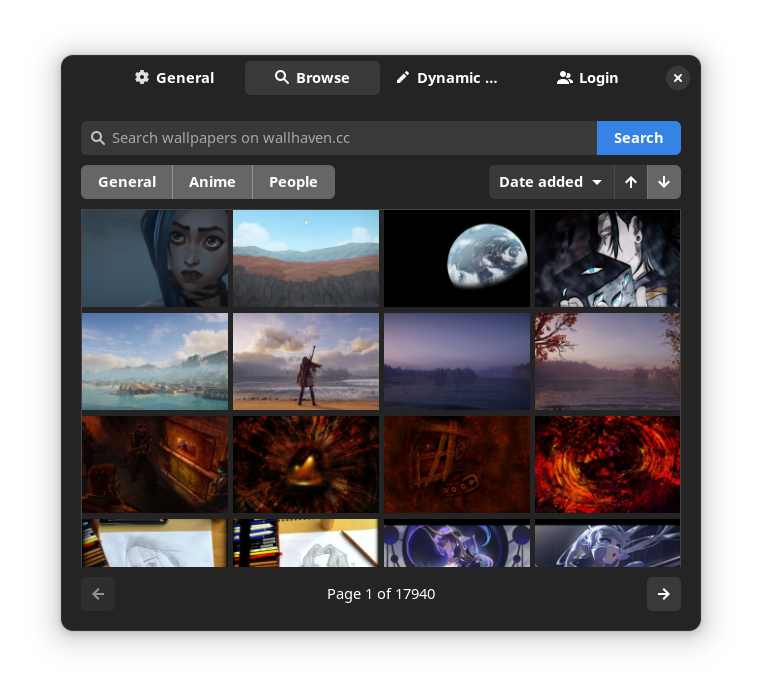
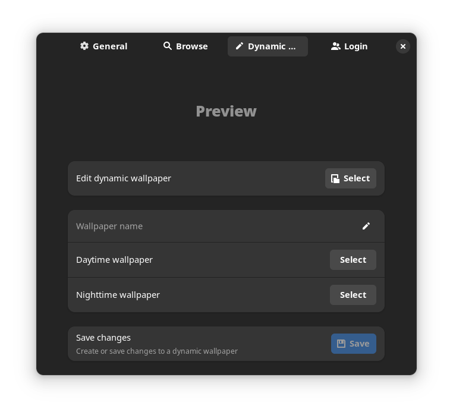
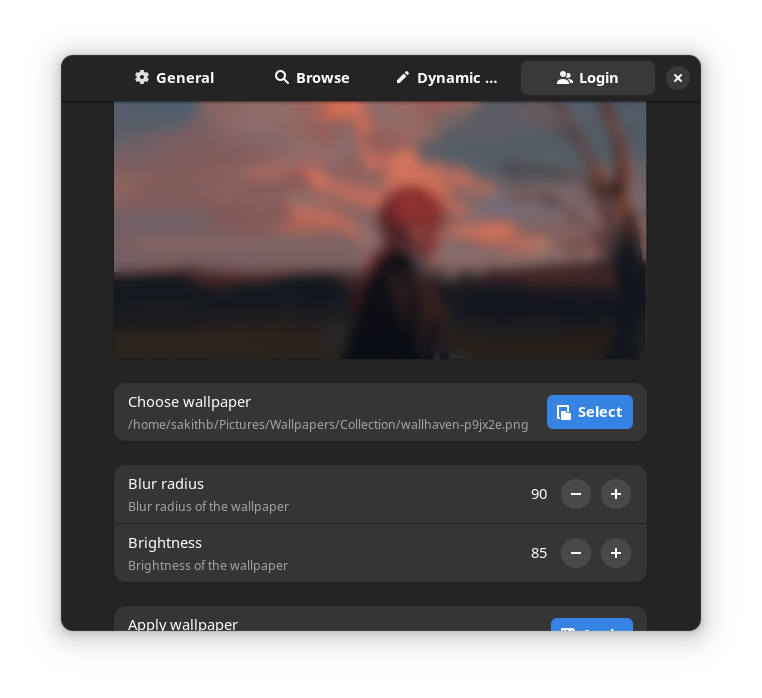

   
  <h1>Wallhub</h1>

Wallhub is a gnome extension that allows you to set wallpapers with ease. Here is a list of features of Wallhub,

- Wallpaper slideshows
- Dynamic wallpapers in slideshows
- Browse wallpapers in the extension
- Create or edit dynamic wallpapers
- Set the GDM wallpaper

## Installation

#### From extensions.gnome.org (Recommended)

#### Manual installation

1. Download the latest release from [here](https://github.com/sakithb/wallhub/releases)
2. Extract the downloaded file
3. Move the folder into `~/.local/share/gnome-shell/extensions/`
4. Log out and log in

## Reporting issues

You can report issues in [here](https://github.com/sakithb/wallhub/issues). Before doing so please make sure you have read the following.

1. Make sure there are no open issues regarding the same problem.
2. After making sure your issue is original, submit an issue with the following information.
   - Distribution name and version
   - Gnome version
   - Extension version

## Screenshots

  
  

  
  

## Get involved

Any type of contribution is appreciated! If you have any suggestions for new features feel free to open a new issue.

If you are interested in translating, download the [po file](https://github.com/sakithb/wallhub/blob/main/assets/locale/wallhub%40sakithb.github.io.pot) and translate it. Then open a pull request with the translated file. You can use [Gtranslator](https://flathub.org/apps/org.gnome.Gtranslator) or [Poedit](https://flathub.org/apps/net.poedit.Poedit) to translate.

If you are interested in contributing code. There are no specific guidelines for contributing. Just make sure you follow the coding style of the project.

If you want to contribute financially, you can do so by donating to the project through [Github Sponsors](https://github.com/sponsors/sakithb) or [Ko-fi](https://ko-fi.com/sakithb).

Make sure to leave a star if you like the project 💫

## Contributors

 

Made with [contrib.rocks](https://contrib.rocks) 
Icon created by [Image Comics - Flaticon](https://www.flaticon.com/free-icons/image-comics)
